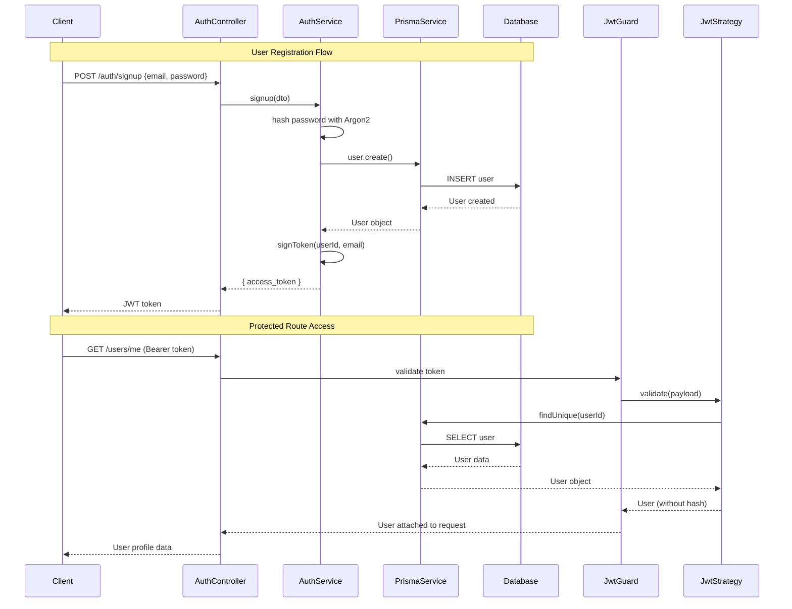

# NestJS Authentication API

A secure REST API built with NestJS and TypeScript, featuring JWT authentication and type-safe data validation. This project was my first exploration into the NestJS framework and TypeScript backend development, helping me understand enterprise-grade Node.js architecture and modern backend patterns.

## Features

- **JWT Authentication**: Secure user registration and login with JSON Web Tokens
- **Type-Safe Validation**: DTO (Data Transfer Objects) with class-validator decorators
- **Password Security**: Argon2 hashing for secure password storage
- **Database Integration**: Prisma ORM with PostgreSQL for type-safe database operations
- **Modular Architecture**: Clean separation of concerns using NestJS modules
- **Docker Support**: Containerized database setup for development and testing
- **Global Guards**: Protected routes using JWT strategy and Passport.js

## Tech Stack

- **NestJS** - Progressive Node.js framework with TypeScript
- **TypeScript** - Type-safe JavaScript development
- **Prisma** - Modern ORM with type generation
- **PostgreSQL** - Relational database
- **JWT** - JSON Web Token authentication
- **Argon2** - Password hashing algorithm
- **Docker** - Containerization for databases
- **Passport.js** - Authentication middleware

## API Endpoints

### Authentication
```
POST   /auth/signup    # User registration with email/password
POST   /auth/signin    # User login and JWT token generation
```

### User Management
```
GET    /users/me       # Get current user profile (protected)
PATCH  /users          # Update user information (protected)
```

### Bookmarks (Planned)
```
# Future bookmark management endpoints
```

## What I Learned

### NestJS Framework
Coming from frontend development, NestJS initially felt complex with its heavy use of decorators, dependency injection, and modular structure. The learning curve included understanding:
- How decorators like `@Controller`, `@Injectable`, and `@Module` work
- Dependency injection and how services are automatically wired together
- The request-response lifecycle and middleware integration

### TypeScript Backend Development
This project deepened my TypeScript knowledge beyond frontend applications:
- Creating strongly-typed DTOs for request validation
- Understanding how TypeScript interfaces work with database schemas
- Leveraging type inference from Prisma client generation

### Modern Authentication Patterns
Learning JWT authentication from scratch taught me:
- How tokens are generated, signed, and verified
- Implementing secure password hashing with Argon2
- Creating authentication guards and strategies with Passport.js
- Protecting routes and extracting user data from tokens

### Data Transfer Objects (DTOs)
The DTO pattern was new to me and proved invaluable for:
- Validating incoming request data with class-validator
- Ensuring type safety throughout the application
- Creating a clear contract between client and server

## Key Implementation Details

### JWT Strategy
```typescript
// JWT validation and user extraction
async validate(payload: { sub: number, email: string }) {
  const user = await this.prisma.user.findUnique({
    where: { id: payload.sub }
  });
  const { hash, ...userWithoutHash } = user || {};
  return userWithoutHash;
}
```

### Type-Safe DTOs
```typescript
export class AuthDto {
  @IsEmail()
  @IsNotEmpty()
  email: string;

  @IsString()
  @IsNotEmpty()
  password: string;
}
```

### Custom Decorators
```typescript
// Extract user from JWT token
@Get('me')
getMe(@GetUser() user: User) {
  return user;
}
```

## System Architecture



---

*This project represents my first deep dive into NestJS and TypeScript backend development, focusing on understanding enterprise patterns, type safety, and modern authentication practices.*
